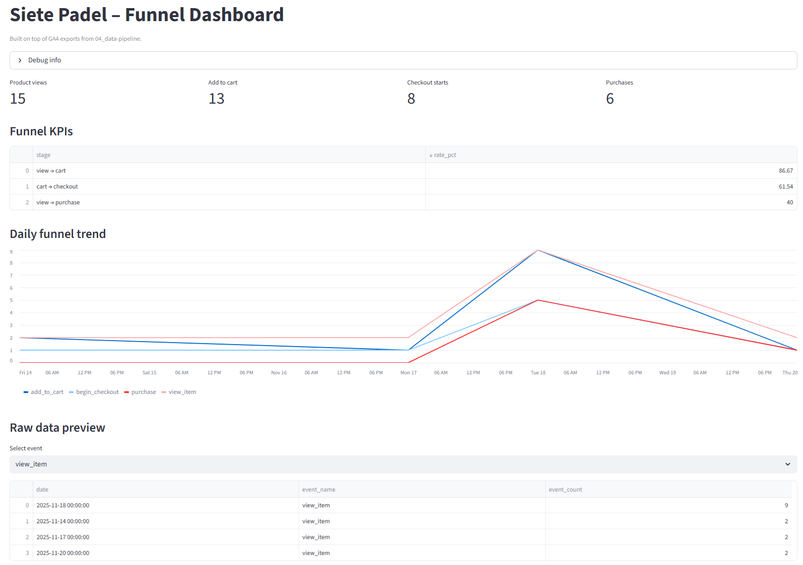

# 07_dashboard – Funnel Dashboard (Streamlit)

This module provides the visual analytics layer of the **Siete Padel – Marketing Analytics Pipeline**.  
It reads the GA4 event exports from `04_data-pipeline/data` and renders funnel KPIs, daily trends, and interactive event previews.

The dashboard is built with **Streamlit** and consumes CSV exports generated by the GA4 Data API pipeline.



## Overview

The dashboard displays:

### Funnel Data
- Product Views (`view_item`)
- Add to Cart (`add_to_cart`)
- Checkout Starts (`begin_checkout`)
- Purchases (`purchase`)

### Conversion Metrics
- View → Cart
- Cart → Checkout
- View → Purchase

### Line Chart
A daily trend visualization across all funnel stages.

### Raw Data Preview
Interactive dataframe explorer for each event type.

### Automatic Debug Layer
Visible in the UI:
- Data directory path  
- List of available CSV files  
- Event totals  

## Folder Structure

07_dashboard/
app.py # Main funnel dashboard (Streamlit)
app_debug.py # Minimalistic debugging utility

## Data Requirements

The following CSV files must exist: 04_data-pipeline/data/ `view_item.csv` `add_to_cart.csv` `begin_checkout.csv` `purchase.csv`

## Running the Dashboard

```bash
.venv\Scripts\activate
streamlit run 07_dashboard/app.py
